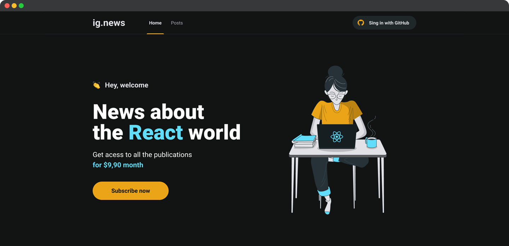

<h1 align="center">
  
</h1>

<p align="center">
  

  
</p>

<br>

<p align="center">
  
</p>

<br>

## 🧪 Tecnologias

Esse projeto foi desenvolvido com as seguintes tecnologias:

- [React](https://reactjs.org)
- [NextJS](https://nextjs.org/)
- [Sass](https://sass-lang.com/)
- [NextAuth](https://next-auth.js.org)
- [Stripe](https://stripe.com/)
- [FaunaDB](https://fauna.com/)
- [Prismic CMS](https://prismic.io/)
- [TypeScript](https://www.typescriptlang.org/)

## 💻 Projeto

O projeto tem como objetivo o estudo e desenvolvimento de uma aplicação em React com NextJS para listagem de posts e sistema de inscrição (subscription).

ig.news foi desenvolvido utilizando o framework NextJS aplicando conceitos como consumo de API externas, API Root, Server Side Rendering (SSR), Static Site Generation (SSG), STRIPE para pagamentos das subscriptions, NextAuth para autenticação com GitHub, FaunaDB para armazenar as informações do usuário em um banco de dados e Prismic CMS para adição e gerenciamento do conteúdo dos posts.

Este é um projeto desenvolvido como prática das aulas do Chapter III da trilha ReactJS do **[Programa Ignite](https://www.rocketseat.com.br/ignite)** da Rocketseat.

## 🚀 Como executar

Clone o projeto e acesse a pasta do mesmo.

```bash
$ git clone https://github.com/rafaelramosdev/ig-news
$ cd ig-news
```

Para iniciá-lo, siga os passos abaixo:

```bash
# Instala as dependências
$ yarn

# Na raiz do projeto, no arquivo .env.local
# Preencha as variáveis ambiente de acordo com as instruções
$ .env.local

# Execute stripe para ouvir eventos do webhook
$ yarn stripe

# Inicia o website
$ yarn dev
```

O website estará disponível no seu navegador pelo endereço [`http://localhost:3000`](http://localhost:3000).

## 📄 Licença

Esse projeto está sob a licença MIT. Veja o arquivo [LICENSE](LICENSE) para mais detalhes.

---

Feito by [Rafael Ramos](https://rafaelramos.dev/) 🙋🏻‍♂️
